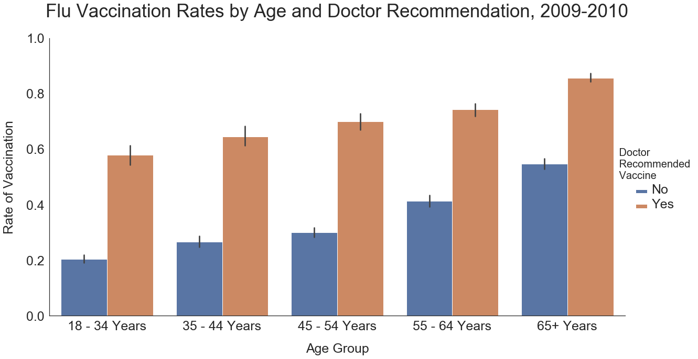
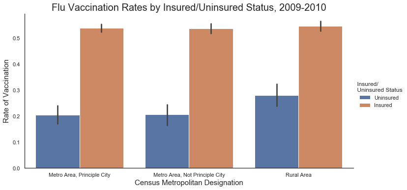

# Targeted Flu Vaccination Outreach

**Author:** Lili Beit
***

## Overview
Lovelace Health, a Federally Qualified Health Center, wishes to increase the proportion of its patients who receive the flu vaccine.  The Health Center plans to reach out to individual patients by phone to encourage them to schedule their vaccine appointments.  

## Business Problem
In addition to targeting those most at risk of complications from the flu, the health center hopes to reach out to those who are least likely to get the vaccine, in order to boost immunity in its patient population generally.

My task is to build a model that can use the patient health and demographic data Lovelace already has on file to predict which patients are unlikely to get the vaccine.

## Data Understanding
To build the model, I used data from the National 2009 H1N1 Flu Survey, a government-sponsored telephone survey designed to monitor vaccination rates for both flu and H1N1 during the 2009-10 season. Specifically, I used the data as curated by DrivenData for its [Flu Shot Learning](https://www.drivendata.org/competitions/66/flu-shot-learning/) competition. 

The data contain over 20,000 survey responses, and show that about 47% of respondents received the flu vaccine. The data include demographic information as well as health insurance status and occupation. Additionally, the data show whether the respondent had a chronic health condition and whether their doctor recommended the flu vaccine.  Demographic features in the data are not representative of the U.S. population at the time. For example, 59% of respondents were women, and the age of respondents was skewed toward older demographics. Additionally, a greater portion of respondents were white than in the general population.

## Modeling
A [baseline logistic regression model](https://github.com/lilisbeit/vaccine-learning/blob/main/baseline-model.ipynb) produced a ROC-AUC score of 0.76 on both the training and test sets.

After feature engineering to reduce the number of columns, a final logistic regression model had a ROC-AUC score of 0.78 for the test and train sets.  Feature engineering and modeling can be viewed in the [final model notebook](http://localhost:8888/notebooks/final-model.ipynb), as can the other models tested.

I also tested a Decision Tree model, a bagged Decision Tree, a Random Forest, an XGBoost model using the 'gbtree' booster, an XGBoost model using the 'dart' booster, and a Support Vector Machine.  None improved on the performance of the Logistic Regression model, so I selected this as my final model.

## Conclusions

### Recommendations

As shown in the [presentation](https://github.com/lilisbeit/vaccine-learning/blob/main/Vaccination-Outreach-Presentation.pdf), the most influential predictor of vaccination is whether or not the respondent's doctor recommended the flu vaccine. This suggests that reaching out to patients who have not had a doctor visit during flu season may improve vaccination rates. It also implies that patients trust their doctors and respond well to their advice.

Health insurance status and urban/rural designation also emerge as influential variables.  The interaction between them is complicated, as lower vaccination rates in rural areas seem to be linked to the uninsured population there.  Lovelace should prioritize their uninsured population for outreach, with a secondary focus on rural patients.  

Finally, it appears that young people are less likely to get the flu vaccine.  Lovelace should target 18-34-year-olds if they want to boost population immunity.

### Further Investigation

Much work remains to paint a clearer picture of which patients are unlikely to get the flu vaccine. It would be helpful to have data that is more representative of all demographic groups.

There are also many ways experiment with making the model more sophisticated. Removing features which influence each other (such as rural and uninsured) may clarify which other features are important. Also, a few geographic and occupational categories have very low values, and eliminating these categories altogether may improve the model. Finally, It may be worthwhile to try deleting rows with null values to see if that sharpens the model.